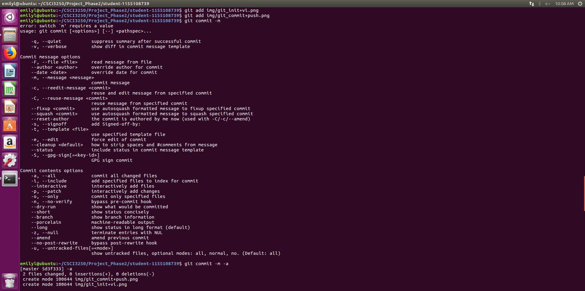
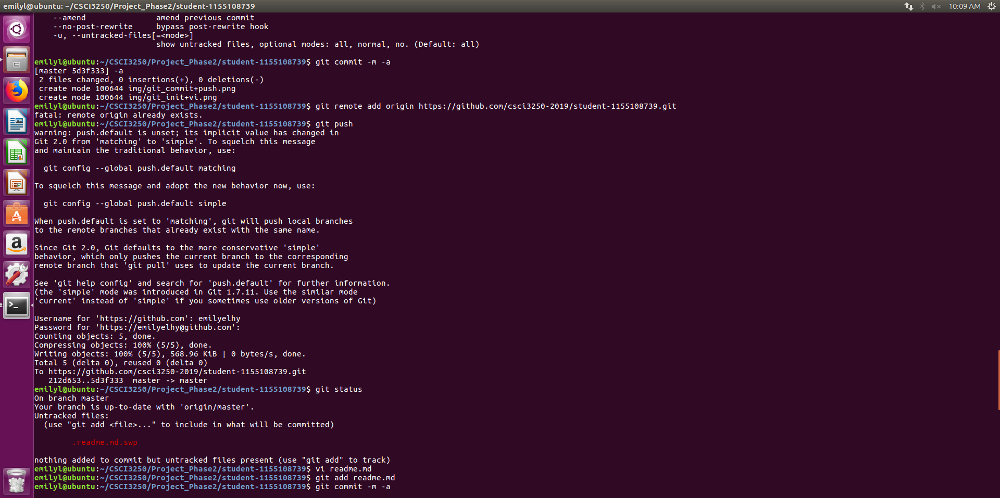

# LAW Hei Yiu :blush:
## A year **2** student from ~~Computer Science~~ **_Computer Engineering_**

| Programming Course Taken | Language Used | Term When Taken |
| :----------------------: | :-----------: | :-------------: |
| ENGG1110 | C | Yr1 T1 |
| CSCI1120 | C++ | Yr2 T1 |
| CSCI2100 | C | Yr2 T2 |

### Programming language that I would like to know
- [x] C
- [x] C++
- [ ] Python
- [ ] Javascript, just want to know how to read javascript, don't want to know how to write it XD

### What I want to do in sem break:
1. **SLEEEEEEEEEEEEEEEEP**
1. Dance
1. Do more research on robot

### Required Screenshots
* Environment: Ubuntu 16.04
* git init & open readme.md: 
* git commit & push: 
* adding pic[1]: 
* adding pic[2]: 
* edting code: 
